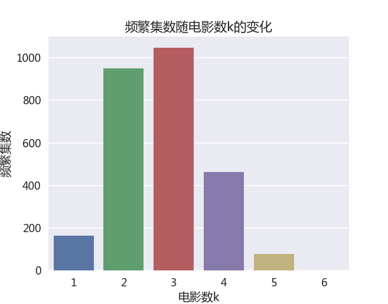

```python
from collections import defaultdict
import pandas as pd
import sys
import pickle
```


```python
def loadMovieData():
    userCol = ['UserID', 'Gender', 'Age', 'Occupation', 'Zip-code']
    users = pd.read_csv('u.user', sep='|', names=userCol, engine='python')
    ratingCol = ['UserID', 'MovieID', 'Rating', 'Timestamp']
    ratings = pd.read_csv('u.data', sep='\t', names=ratingCol, engine='python')
    movieCol = ['MovieID', 'Title', 'Date']
    movies = pd.read_csv('u.item', sep='|', names=movieCol, engine='python',usecols = [0,1,2], index_col=0)
    return users, ratings, movies
```

# 加载数据集


```python
usersdf, ratingsdf, moviesdf = loadMovieData()
```

# 只取评分高于3的数据项，视为用户喜欢的电影


```python
ratingsdf["Favorable"] = ratingsdf["Rating"] > 3
ratingsdf = ratingsdf[ratingsdf['Favorable']].drop('Favorable', axis=1)
```

# 创建字典，key为用户ID，value为用户喜欢的所有电影的frozenset


```python
usersFavorableMoviesDict = dict((k, frozenset(v.values))for k, v in ratingsdf.groupby("UserID")["MovieID"])
```

# 在所有电影数目为k的集合中找出满足最小支持度的频繁集，并创建字典，key为k部电影的fronzeset，value为对应的支持度


```python
def findFreqSet(usersFavorableMoviesDict, kMovieIter, minSupport):
    countDict = defaultdict(int)
    for user, favorMovieSet in usersFavorableMoviesDict.items():
        for kMovieSet in kMovieIter:
            if favorMovieSet.issuperset(kMovieSet):
                countDict[kMovieSet] += 1
    return dict([(kMovieSet, count) for kMovieSet, count in countDict.items() if count >= minSupport])
```

# 利用k部电影的频繁集与单部电影的频繁集生成k+1部电影的集合，调用上个函数来找出其中的频繁集


```python
def getKPlusFreqSet(kMovieList, singleMovieList, usersFavorMoviesDict, minSupport=50):
    kPlusMovie = dict()
    k = len(kMovieList[0])
    for kMovieSet in kMovieList:
        for singleMovie in singleMovieList:
            temp = singleMovie | kMovieSet
            if len(temp) == k:
                continue
            kPlusMovie[singleMovie | kMovieSet] = 1
    return findFreqSet(usersFavorMoviesDict, kPlusMovie.keys(), minSupport)
```

# 根据最小支持度先生成单部电影的频繁，然后迭代生成k部电影的频繁集，直至频繁集为空，最后用pickle模块保存至硬盘


```python
def findAllFreqSet(ratingsdf,minSupport = 100):
    usersFavorMoviesDict = dict((k, frozenset(v.values))for k, v in ratingsdf.groupby("UserID")["MovieID"])
    movieFavorNums = ratingsdf.groupby('MovieID')['UserID'].count()
    singleMovieID = movieFavorNums[movieFavorNums >= minSupport].index
    singleMovieList = [frozenset([movieID]) for movieID in singleMovieID]
    singleMovieDict = movieFavorNums[movieFavorNums >= minSupport].to_dict()
    with open('1movieFreqDict','wb') as f:
        pickle.dump(singleMovieDict, f)
    kMovieList = singleMovieList
    for k in range(2, 100):
        print(k)
        sys.stdout.flush()
        kMovieDict = getKPlusFreqSet(kMovieList, singleMovieList, usersFavorMoviesDict, minSupport)
        if not kMovieDict:
            break
        kMovieList = list(kMovieDict.keys())
        with open('{!s}movieFreqDict'.format(k), 'wb') as f:
            pickle.dump(kMovieDict, f)
        del kMovieDict
```

# 以最小支持度为100，找出所有频繁集


```python
findAllFreqSet(ratingsdf, minSupport=100)
```

# 读出所有频繁集，放入字典


```python
import re,os
freqSetDict = dict()
fileList = [file for file in os.listdir() if "movieFreqDict" in file]
for file in fileList:
    num = int(re.match('\d+', file).group())
    with open(file, 'rb') as f:
        freqSetDict[num] = pickle.load(f)
```


```python
from pylab import *
mpl.rcParams['font.sans-serif'] = ['Microsoft YaHei']
%matplotlib
import seaborn as sns
sns.set_context("talk")
```

    Using matplotlib backend: Qt5Agg
    


```python
kMovieCount = dict((k, len(v)) for k, v in freqSetDict.items())
ax = sns.barplot(x=list(kMovieCount.keys()),y=list(kMovieCount.values()))
ax.set_title('频繁集数随电影数k的变化')
ax.set_xlabel('电影数k')
ax.set_ylabel('频繁集数')
```


    <matplotlib.text.Text at 0xc1d3be0>




# 取出所有k=5的频繁集计算其中每一部电影相对于k=4的置信度


```python
confidenceDict = defaultdict(dict)
confidenceDictEachMovie = defaultdict(list)
for movieFreqSet in freqSetDict[5]:
    count = freqSetDict[5][movieFreqSet]
    for movie in movieFreqSet:
        confidence = count/freqSetDict[4][movieFreqSet - frozenset([movie])]
        confidenceDict[movieFreqSet - frozenset([movie])][movie]=confidence
        confidenceDictEachMovie[movie].append(confidence)
```

# 该函数可以将电影ID或者电影ID集合转换为对应电影标题的字符串


```python
def getTitleByMovieID(movie):
    if isinstance(movie, frozenset):
        return (',').join([moviesdf.ix[movieID].Title for movieID in movie])
    else:
        try:
            return moviesdf.ix[int(movie)].Title
        except:
            raise TypeError("the input must be the movieID number or the frozenset of movieID numbers")
```

# 对于已经观看的四部电影的用户，可以根据置信度推荐下一部可观看的电影


```python
for freqSet, confiDict in confidenceDict.items():
    for movieID,confidence in confiDict.items():
        if confidence >0.9:
            print('对于观看了{!s}的观众，推荐观看{!s}，置信度为{:.2%}'.format(getTitleByMovieID(freqSet), getTitleByMovieID(movieID), confidence))
            print('--------------------------------------------------------------------------------------------------------------------')
```

    对于观看了Indiana Jones and the Last Crusade (1989),Empire Strikes Back, The (1980),Princess Bride, The (1987),Raiders of the Lost Ark (1981)的观众，推荐观看Star Wars (1977)，置信度为100.00%
    --------------------------------------------------------------------------------------------------------------------
    对于观看了Star Wars (1977),Terminator, The (1984),Princess Bride, The (1987),Raiders of the Lost Ark (1981)的观众，推荐观看Empire Strikes Back, The (1980)，置信度为91.23%
    --------------------------------------------------------------------------------------------------------------------
    对于观看了Star Wars (1977),Back to the Future (1985),Forrest Gump (1994),Raiders of the Lost Ark (1981)的观众，推荐观看Empire Strikes Back, The (1980)，置信度为93.64%
    --------------------------------------------------------------------------------------------------------------------
    对于观看了Indiana Jones and the Last Crusade (1989),Star Wars (1977),Princess Bride, The (1987),Raiders of the Lost Ark (1981)的观众，推荐观看Empire Strikes Back, The (1980)，置信度为94.69%
    --------------------------------------------------------------------------------------------------------------------
    对于观看了Terminator 2: Judgment Day (1991),Terminator, The (1984),Empire Strikes Back, The (1980),Return of the Jedi (1983)的观众，推荐观看Star Wars (1977)，置信度为98.06%
    --------------------------------------------------------------------------------------------------------------------
    对于观看了Terminator 2: Judgment Day (1991),Terminator, The (1984),Empire Strikes Back, The (1980),Return of the Jedi (1983)的观众，推荐观看Raiders of the Lost Ark (1981)，置信度为98.06%
    --------------------------------------------------------------------------------------------------------------------
    对于观看了Indiana Jones and the Last Crusade (1989),Star Wars (1977),Return of the Jedi (1983),Raiders of the Lost Ark (1981)的观众，推荐观看Empire Strikes Back, The (1980)，置信度为93.75%
    --------------------------------------------------------------------------------------------------------------------
    对于观看了Monty Python and the Holy Grail (1974),Silence of the Lambs, The (1991),Empire Strikes Back, The (1980),Star Wars (1977)的观众，推荐观看Raiders of the Lost Ark (1981)，置信度为91.82%
    --------------------------------------------------------------------------------------------------------------------
    对于观看了Silence of the Lambs, The (1991),Star Wars (1977),Return of the Jedi (1983),Fugitive, The (1993)的观众，推荐观看Raiders of the Lost Ark (1981)，置信度为90.52%
    --------------------------------------------------------------------------------------------------------------------
    对于观看了Terminator 2: Judgment Day (1991),Star Wars (1977),Empire Strikes Back, The (1980),Fugitive, The (1993)的观众，推荐观看Raiders of the Lost Ark (1981)，置信度为91.45%
    --------------------------------------------------------------------------------------------------------------------
    对于观看了Indiana Jones and the Last Crusade (1989),Back to the Future (1985),Star Wars (1977),Raiders of the Lost Ark (1981)的观众，推荐观看Empire Strikes Back, The (1980)，置信度为92.74%
    --------------------------------------------------------------------------------------------------------------------
    对于观看了Indiana Jones and the Last Crusade (1989),Star Wars (1977),Return of the Jedi (1983),Silence of the Lambs, The (1991)的观众，推荐观看Empire Strikes Back, The (1980)，置信度为93.46%
    --------------------------------------------------------------------------------------------------------------------
    对于观看了Indiana Jones and the Last Crusade (1989),Star Wars (1977),Return of the Jedi (1983),Silence of the Lambs, The (1991)的观众，推荐观看Raiders of the Lost Ark (1981)，置信度为93.46%
    --------------------------------------------------------------------------------------------------------------------
    对于观看了Indiana Jones and the Last Crusade (1989),Back to the Future (1985),Empire Strikes Back, The (1980),Star Wars (1977)的观众，推荐观看Raiders of the Lost Ark (1981)，置信度为96.64%
    --------------------------------------------------------------------------------------------------------------------
    对于观看了Star Wars (1977),Back to the Future (1985),Empire Strikes Back, The (1980),Princess Bride, The (1987)的观众，推荐观看Raiders of the Lost Ark (1981)，置信度为95.33%
    --------------------------------------------------------------------------------------------------------------------
    对于观看了Monty Python and the Holy Grail (1974),Star Wars (1977),Empire Strikes Back, The (1980),Princess Bride, The (1987)的观众，推荐观看Raiders of the Lost Ark (1981)，置信度为93.69%
    --------------------------------------------------------------------------------------------------------------------
    对于观看了Empire Strikes Back, The (1980),Princess Bride, The (1987),Raiders of the Lost Ark (1981),Fugitive, The (1993)的观众，推荐观看Star Wars (1977)，置信度为100.00%
    --------------------------------------------------------------------------------------------------------------------
    对于观看了Empire Strikes Back, The (1980),Return of the Jedi (1983),Raiders of the Lost Ark (1981),Braveheart (1995)的观众，推荐观看Star Wars (1977)，置信度为97.50%
    --------------------------------------------------------------------------------------------------------------------
    对于观看了Terminator 2: Judgment Day (1991),Silence of the Lambs, The (1991),Empire Strikes Back, The (1980),Star Wars (1977)的观众，推荐观看Raiders of the Lost Ark (1981)，置信度为91.74%
    --------------------------------------------------------------------------------------------------------------------
    对于观看了Indiana Jones and the Last Crusade (1989),Empire Strikes Back, The (1980),Return of the Jedi (1983),Silence of the Lambs, The (1991)的观众，推荐观看Star Wars (1977)，置信度为98.04%
    --------------------------------------------------------------------------------------------------------------------
    对于观看了Star Wars (1977),Back to the Future (1985),Empire Strikes Back, The (1980),Return of the Jedi (1983)的观众，推荐观看Raiders of the Lost Ark (1981)，置信度为93.28%
    --------------------------------------------------------------------------------------------------------------------
    对于观看了Indiana Jones and the Last Crusade (1989),Terminator, The (1984),Empire Strikes Back, The (1980),Star Wars (1977)的观众，推荐观看Raiders of the Lost Ark (1981)，置信度为98.23%
    --------------------------------------------------------------------------------------------------------------------
    对于观看了Silence of the Lambs, The (1991),Forrest Gump (1994),Empire Strikes Back, The (1980),Star Wars (1977)的观众，推荐观看Raiders of the Lost Ark (1981)，置信度为97.32%
    --------------------------------------------------------------------------------------------------------------------
    对于观看了Shawshank Redemption, The (1994),Empire Strikes Back, The (1980),Return of the Jedi (1983),Raiders of the Lost Ark (1981)的观众，推荐观看Star Wars (1977)，置信度为97.27%
    --------------------------------------------------------------------------------------------------------------------
    对于观看了Star Wars (1977),Return of the Jedi (1983),Raiders of the Lost Ark (1981),Alien (1979)的观众，推荐观看Empire Strikes Back, The (1980)，置信度为90.16%
    --------------------------------------------------------------------------------------------------------------------
    对于观看了Indiana Jones and the Last Crusade (1989),Terminator, The (1984),Star Wars (1977),Raiders of the Lost Ark (1981)的观众，推荐观看Empire Strikes Back, The (1980)，置信度为96.52%
    --------------------------------------------------------------------------------------------------------------------
    对于观看了Silence of the Lambs, The (1991),Empire Strikes Back, The (1980),Raiders of the Lost Ark (1981),Alien (1979)的观众，推荐观看Star Wars (1977)，置信度为97.09%
    --------------------------------------------------------------------------------------------------------------------
    对于观看了Indiana Jones and the Last Crusade (1989),Back to the Future (1985),Empire Strikes Back, The (1980),Raiders of the Lost Ark (1981)的观众，推荐观看Star Wars (1977)，置信度为98.29%
    --------------------------------------------------------------------------------------------------------------------
    对于观看了Silence of the Lambs, The (1991),Terminator, The (1984),Empire Strikes Back, The (1980),Star Wars (1977)的观众，推荐观看Raiders of the Lost Ark (1981)，置信度为97.41%
    --------------------------------------------------------------------------------------------------------------------
    对于观看了Terminator, The (1984),Empire Strikes Back, The (1980),Raiders of the Lost Ark (1981),Fugitive, The (1993)的观众，推荐观看Star Wars (1977)，置信度为97.22%
    --------------------------------------------------------------------------------------------------------------------
    对于观看了Silence of the Lambs, The (1991),Empire Strikes Back, The (1980),Princess Bride, The (1987),Raiders of the Lost Ark (1981)的观众，推荐观看Star Wars (1977)，置信度为99.13%
    --------------------------------------------------------------------------------------------------------------------
    对于观看了Terminator 2: Judgment Day (1991),Star Wars (1977),Princess Bride, The (1987),Raiders of the Lost Ark (1981)的观众，推荐观看Empire Strikes Back, The (1980)，置信度为93.69%
    --------------------------------------------------------------------------------------------------------------------
    对于观看了Silence of the Lambs, The (1991),Back to the Future (1985),Star Wars (1977),Raiders of the Lost Ark (1981)的观众，推荐观看Empire Strikes Back, The (1980)，置信度为91.13%
    --------------------------------------------------------------------------------------------------------------------
    对于观看了Star Wars (1977),Empire Strikes Back, The (1980),Return of the Jedi (1983),Braveheart (1995)的观众，推荐观看Raiders of the Lost Ark (1981)，置信度为90.70%
    --------------------------------------------------------------------------------------------------------------------
    对于观看了Silence of the Lambs, The (1991),Empire Strikes Back, The (1980),Star Wars (1977),Braveheart (1995)的观众，推荐观看Raiders of the Lost Ark (1981)，置信度为93.58%
    --------------------------------------------------------------------------------------------------------------------
    对于观看了Silence of the Lambs, The (1991),Empire Strikes Back, The (1980),Raiders of the Lost Ark (1981),Fugitive, The (1993)的观众，推荐观看Star Wars (1977)，置信度为96.55%
    --------------------------------------------------------------------------------------------------------------------
    对于观看了Terminator 2: Judgment Day (1991),Star Wars (1977),Raiders of the Lost Ark (1981),Alien (1979)的观众，推荐观看Empire Strikes Back, The (1980)，置信度为92.66%
    --------------------------------------------------------------------------------------------------------------------
    对于观看了Pulp Fiction (1994),Silence of the Lambs, The (1991),Empire Strikes Back, The (1980),Raiders of the Lost Ark (1981)的观众，推荐观看Star Wars (1977)，置信度为95.54%
    --------------------------------------------------------------------------------------------------------------------
    对于观看了Silence of the Lambs, The (1991),Return of the Jedi (1983),Raiders of the Lost Ark (1981),Fugitive, The (1993)的观众，推荐观看Star Wars (1977)，置信度为97.22%
    --------------------------------------------------------------------------------------------------------------------
    对于观看了Silence of the Lambs, The (1991),Empire Strikes Back, The (1980),Back to the Future (1985),Raiders of the Lost Ark (1981)的观众，推荐观看Star Wars (1977)，置信度为95.76%
    --------------------------------------------------------------------------------------------------------------------
    对于观看了Star Wars (1977),Back to the Future (1985),Princess Bride, The (1987),Raiders of the Lost Ark (1981)的观众，推荐观看Empire Strikes Back, The (1980)，置信度为92.73%
    --------------------------------------------------------------------------------------------------------------------
    对于观看了Indiana Jones and the Last Crusade (1989),Return of the Jedi (1983),Raiders of the Lost Ark (1981),Silence of the Lambs, The (1991)的观众，推荐观看Star Wars (1977)，置信度为99.01%
    --------------------------------------------------------------------------------------------------------------------
    对于观看了Indiana Jones and the Last Crusade (1989),Empire Strikes Back, The (1980),Star Wars (1977),Silence of the Lambs, The (1991)的观众，推荐观看Raiders of the Lost Ark (1981)，置信度为96.46%
    --------------------------------------------------------------------------------------------------------------------
    对于观看了Terminator 2: Judgment Day (1991),Star Wars (1977),Terminator, The (1984),Fugitive, The (1993)的观众，推荐观看Raiders of the Lost Ark (1981)，置信度为96.30%
    --------------------------------------------------------------------------------------------------------------------
    对于观看了Pulp Fiction (1994),Empire Strikes Back, The (1980),Princess Bride, The (1987),Raiders of the Lost Ark (1981)的观众，推荐观看Star Wars (1977)，置信度为99.02%
    --------------------------------------------------------------------------------------------------------------------
    对于观看了Terminator 2: Judgment Day (1991),Silence of the Lambs, The (1991),Empire Strikes Back, The (1980),Raiders of the Lost Ark (1981)的观众，推荐观看Star Wars (1977)，置信度为96.15%
    --------------------------------------------------------------------------------------------------------------------
    对于观看了Back to the Future (1985),Empire Strikes Back, The (1980),Return of the Jedi (1983),Raiders of the Lost Ark (1981)的观众，推荐观看Star Wars (1977)，置信度为97.66%
    --------------------------------------------------------------------------------------------------------------------
    对于观看了Star Wars (1977),Empire Strikes Back, The (1980),Return of the Jedi (1983),Alien (1979)的观众，推荐观看Raiders of the Lost Ark (1981)，置信度为90.16%
    --------------------------------------------------------------------------------------------------------------------
    对于观看了Terminator 2: Judgment Day (1991),Indiana Jones and the Last Crusade (1989),Empire Strikes Back, The (1980),Star Wars (1977)的观众，推荐观看Raiders of the Lost Ark (1981)，置信度为96.36%
    --------------------------------------------------------------------------------------------------------------------
    对于观看了Toy Story (1995),Empire Strikes Back, The (1980),Return of the Jedi (1983),Raiders of the Lost Ark (1981)的观众，推荐观看Star Wars (1977)，置信度为97.30%
    --------------------------------------------------------------------------------------------------------------------
    对于观看了Silence of the Lambs, The (1991),Empire Strikes Back, The (1980),Star Wars (1977),Princess Bride, The (1987)的观众，推荐观看Raiders of the Lost Ark (1981)，置信度为95.80%
    --------------------------------------------------------------------------------------------------------------------
    对于观看了Pulp Fiction (1994),Empire Strikes Back, The (1980),Raiders of the Lost Ark (1981),Fugitive, The (1993)的观众，推荐观看Star Wars (1977)，置信度为97.20%
    --------------------------------------------------------------------------------------------------------------------
    对于观看了Terminator 2: Judgment Day (1991),Indiana Jones and the Last Crusade (1989),Star Wars (1977),Raiders of the Lost Ark (1981)的观众，推荐观看Empire Strikes Back, The (1980)，置信度为93.81%
    --------------------------------------------------------------------------------------------------------------------
    对于观看了Empire Strikes Back, The (1980),Back to the Future (1985),Raiders of the Lost Ark (1981),Fugitive, The (1993)的观众，推荐观看Star Wars (1977)，置信度为97.35%
    --------------------------------------------------------------------------------------------------------------------
    对于观看了Star Wars (1977),Empire Strikes Back, The (1980),Braveheart (1995),Fugitive, The (1993)的观众，推荐观看Raiders of the Lost Ark (1981)，置信度为91.89%
    --------------------------------------------------------------------------------------------------------------------
    对于观看了Indiana Jones and the Last Crusade (1989),Empire Strikes Back, The (1980),Return of the Jedi (1983),Raiders of the Lost Ark (1981)的观众，推荐观看Star Wars (1977)，置信度为99.26%
    --------------------------------------------------------------------------------------------------------------------
    对于观看了Shawshank Redemption, The (1994),Silence of the Lambs, The (1991),Empire Strikes Back, The (1980),Return of the Jedi (1983)的观众，推荐观看Star Wars (1977)，置信度为97.09%
    --------------------------------------------------------------------------------------------------------------------
    对于观看了Pulp Fiction (1994),Indiana Jones and the Last Crusade (1989),Empire Strikes Back, The (1980),Star Wars (1977)的观众，推荐观看Raiders of the Lost Ark (1981)，置信度为93.58%
    --------------------------------------------------------------------------------------------------------------------
    对于观看了Terminator 2: Judgment Day (1991),Empire Strikes Back, The (1980),Raiders of the Lost Ark (1981),Fugitive, The (1993)的观众，推荐观看Star Wars (1977)，置信度为98.17%
    --------------------------------------------------------------------------------------------------------------------
    对于观看了Pulp Fiction (1994),Indiana Jones and the Last Crusade (1989),Star Wars (1977),Raiders of the Lost Ark (1981)的观众，推荐观看Empire Strikes Back, The (1980)，置信度为91.89%
    --------------------------------------------------------------------------------------------------------------------
    对于观看了Indiana Jones and the Last Crusade (1989),Empire Strikes Back, The (1980),Return of the Jedi (1983),Fugitive, The (1993)的观众，推荐观看Star Wars (1977)，置信度为99.04%
    --------------------------------------------------------------------------------------------------------------------
    对于观看了Terminator 2: Judgment Day (1991),Pulp Fiction (1994),Empire Strikes Back, The (1980),Raiders of the Lost Ark (1981)的观众，推荐观看Star Wars (1977)，置信度为95.28%
    --------------------------------------------------------------------------------------------------------------------
    对于观看了Silence of the Lambs, The (1991),Princess Bride, The (1987),Raiders of the Lost Ark (1981),Return of the Jedi (1983)的观众，推荐观看Star Wars (1977)，置信度为99.07%
    --------------------------------------------------------------------------------------------------------------------
    对于观看了Silence of the Lambs, The (1991),Princess Bride, The (1987),Raiders of the Lost Ark (1981),Return of the Jedi (1983)的观众，推荐观看Empire Strikes Back, The (1980)，置信度为93.46%
    --------------------------------------------------------------------------------------------------------------------
    对于观看了Back to the Future (1985),Terminator, The (1984),Empire Strikes Back, The (1980),Raiders of the Lost Ark (1981)的观众，推荐观看Star Wars (1977)，置信度为95.24%
    --------------------------------------------------------------------------------------------------------------------
    对于观看了Star Wars (1977),Terminator, The (1984),Return of the Jedi (1983),Raiders of the Lost Ark (1981)的观众，推荐观看Empire Strikes Back, The (1980)，置信度为91.60%
    --------------------------------------------------------------------------------------------------------------------
    对于观看了Silence of the Lambs, The (1991),Empire Strikes Back, The (1980),Return of the Jedi (1983),Fugitive, The (1993)的观众，推荐观看Star Wars (1977)，置信度为98.10%
    --------------------------------------------------------------------------------------------------------------------
    对于观看了Terminator 2: Judgment Day (1991),Empire Strikes Back, The (1980),Raiders of the Lost Ark (1981),Alien (1979)的观众，推荐观看Star Wars (1977)，置信度为98.06%
    --------------------------------------------------------------------------------------------------------------------
    对于观看了Terminator, The (1984),Empire Strikes Back, The (1980),Return of the Jedi (1983),Raiders of the Lost Ark (1981)的观众，推荐观看Star Wars (1977)，置信度为96.77%
    --------------------------------------------------------------------------------------------------------------------
    对于观看了Terminator 2: Judgment Day (1991),Star Wars (1977),Empire Strikes Back, The (1980),Princess Bride, The (1987)的观众，推荐观看Raiders of the Lost Ark (1981)，置信度为93.69%
    --------------------------------------------------------------------------------------------------------------------
    对于观看了Terminator 2: Judgment Day (1991),Empire Strikes Back, The (1980),Return of the Jedi (1983),Raiders of the Lost Ark (1981)的观众，推荐观看Star Wars (1977)，置信度为98.32%
    --------------------------------------------------------------------------------------------------------------------
    对于观看了Silence of the Lambs, The (1991),Empire Strikes Back, The (1980),Back to the Future (1985),Star Wars (1977)的观众，推荐观看Raiders of the Lost Ark (1981)，置信度为94.17%
    --------------------------------------------------------------------------------------------------------------------
    对于观看了Aliens (1986),Empire Strikes Back, The (1980),Raiders of the Lost Ark (1981),Alien (1979)的观众，推荐观看Star Wars (1977)，置信度为97.12%
    --------------------------------------------------------------------------------------------------------------------
    对于观看了Star Wars (1977),Empire Strikes Back, The (1980),Return of the Jedi (1983),E.T. the Extra-Terrestrial (1982)的观众，推荐观看Raiders of the Lost Ark (1981)，置信度为90.09%
    --------------------------------------------------------------------------------------------------------------------
    对于观看了Star Wars (1977),Terminator, The (1984),Empire Strikes Back, The (1980),Princess Bride, The (1987)的观众，推荐观看Raiders of the Lost Ark (1981)，置信度为99.05%
    --------------------------------------------------------------------------------------------------------------------
    对于观看了Indiana Jones and the Last Crusade (1989),Empire Strikes Back, The (1980),Raiders of the Lost Ark (1981),Silence of the Lambs, The (1991)的观众，推荐观看Star Wars (1977)，置信度为97.32%
    --------------------------------------------------------------------------------------------------------------------
    对于观看了Fugitive, The (1993),Return of the Jedi (1983),Raiders of the Lost Ark (1981),Princess Bride, The (1987)的观众，推荐观看Star Wars (1977)，置信度为100.00%
    --------------------------------------------------------------------------------------------------------------------
    对于观看了Star Wars (1977),Return of the Jedi (1983),Raiders of the Lost Ark (1981),E.T. the Extra-Terrestrial (1982)的观众，推荐观看Empire Strikes Back, The (1980)，置信度为90.91%
    --------------------------------------------------------------------------------------------------------------------
    对于观看了Pulp Fiction (1994),Star Wars (1977),Empire Strikes Back, The (1980),Princess Bride, The (1987)的观众，推荐观看Raiders of the Lost Ark (1981)，置信度为92.66%
    --------------------------------------------------------------------------------------------------------------------
    对于观看了Pulp Fiction (1994),Empire Strikes Back, The (1980),Return of the Jedi (1983),Raiders of the Lost Ark (1981)的观众，推荐观看Star Wars (1977)，置信度为98.29%
    --------------------------------------------------------------------------------------------------------------------
    对于观看了Empire Strikes Back, The (1980),Return of the Jedi (1983),Raiders of the Lost Ark (1981),Fugitive, The (1993)的观众，推荐观看Star Wars (1977)，置信度为98.41%
    --------------------------------------------------------------------------------------------------------------------
    对于观看了Terminator 2: Judgment Day (1991),Indiana Jones and the Last Crusade (1989),Empire Strikes Back, The (1980),Raiders of the Lost Ark (1981)的观众，推荐观看Star Wars (1977)，置信度为98.15%
    --------------------------------------------------------------------------------------------------------------------
    对于观看了Indiana Jones and the Last Crusade (1989),Terminator, The (1984),Empire Strikes Back, The (1980),Raiders of the Lost Ark (1981)的观众，推荐观看Star Wars (1977)，置信度为98.23%
    --------------------------------------------------------------------------------------------------------------------
    对于观看了Silence of the Lambs, The (1991),Forrest Gump (1994),Raiders of the Lost Ark (1981),Return of the Jedi (1983)的观众，推荐观看Star Wars (1977)，置信度为99.02%
    --------------------------------------------------------------------------------------------------------------------
    对于观看了Star Wars (1977),Empire Strikes Back, The (1980),Back to the Future (1985),Fugitive, The (1993)的观众，推荐观看Raiders of the Lost Ark (1981)，置信度为94.83%
    --------------------------------------------------------------------------------------------------------------------
    对于观看了Empire Strikes Back, The (1980),Princess Bride, The (1987),Raiders of the Lost Ark (1981),Return of the Jedi (1983)的观众，推荐观看Star Wars (1977)，置信度为99.22%
    --------------------------------------------------------------------------------------------------------------------
    对于观看了Terminator 2: Judgment Day (1991),Terminator, The (1984),Return of the Jedi (1983),Raiders of the Lost Ark (1981)的观众，推荐观看Star Wars (1977)，置信度为98.17%
    --------------------------------------------------------------------------------------------------------------------
    对于观看了Terminator 2: Judgment Day (1991),Terminator, The (1984),Return of the Jedi (1983),Raiders of the Lost Ark (1981)的观众，推荐观看Empire Strikes Back, The (1980)，置信度为92.66%
    --------------------------------------------------------------------------------------------------------------------
    对于观看了Terminator 2: Judgment Day (1991),Star Wars (1977),Terminator, The (1984),Empire Strikes Back, The (1980)的观众，推荐观看Raiders of the Lost Ark (1981)，置信度为96.80%
    --------------------------------------------------------------------------------------------------------------------
    对于观看了Monty Python and the Holy Grail (1974),Indiana Jones and the Last Crusade (1989),Empire Strikes Back, The (1980),Raiders of the Lost Ark (1981)的观众，推荐观看Star Wars (1977)，置信度为98.15%
    --------------------------------------------------------------------------------------------------------------------
    对于观看了Indiana Jones and the Last Crusade (1989),Back to the Future (1985),Return of the Jedi (1983),Raiders of the Lost Ark (1981)的观众，推荐观看Star Wars (1977)，置信度为98.11%
    --------------------------------------------------------------------------------------------------------------------
    对于观看了Indiana Jones and the Last Crusade (1989),Back to the Future (1985),Return of the Jedi (1983),Raiders of the Lost Ark (1981)的观众，推荐观看Empire Strikes Back, The (1980)，置信度为95.28%
    --------------------------------------------------------------------------------------------------------------------
    对于观看了Star Wars (1977),Forrest Gump (1994),Raiders of the Lost Ark (1981),Return of the Jedi (1983)的观众，推荐观看Empire Strikes Back, The (1980)，置信度为92.80%
    --------------------------------------------------------------------------------------------------------------------
    对于观看了Indiana Jones and the Last Crusade (1989),Empire Strikes Back, The (1980),Star Wars (1977),Braveheart (1995)的观众，推荐观看Raiders of the Lost Ark (1981)，置信度为93.81%
    --------------------------------------------------------------------------------------------------------------------
    对于观看了Aliens (1986),Star Wars (1977),Terminator, The (1984),Empire Strikes Back, The (1980)的观众，推荐观看Raiders of the Lost Ark (1981)，置信度为97.14%
    --------------------------------------------------------------------------------------------------------------------
    对于观看了Terminator 2: Judgment Day (1991),Back to the Future (1985),Empire Strikes Back, The (1980),Raiders of the Lost Ark (1981)的观众，推荐观看Star Wars (1977)，置信度为97.17%
    --------------------------------------------------------------------------------------------------------------------
    对于观看了Terminator 2: Judgment Day (1991),Star Wars (1977),Terminator, The (1984),Return of the Jedi (1983)的观众，推荐观看Empire Strikes Back, The (1980)，置信度为92.66%
    --------------------------------------------------------------------------------------------------------------------
    对于观看了Terminator 2: Judgment Day (1991),Star Wars (1977),Terminator, The (1984),Return of the Jedi (1983)的观众，推荐观看Raiders of the Lost Ark (1981)，置信度为98.17%
    --------------------------------------------------------------------------------------------------------------------
    对于观看了Indiana Jones and the Last Crusade (1989),Star Wars (1977),Raiders of the Lost Ark (1981),Fugitive, The (1993)的观众，推荐观看Empire Strikes Back, The (1980)，置信度为92.74%
    --------------------------------------------------------------------------------------------------------------------
    对于观看了Star Wars (1977),Return of the Jedi (1983),Fugitive, The (1993),Princess Bride, The (1987)的观众，推荐观看Raiders of the Lost Ark (1981)，置信度为92.59%
    --------------------------------------------------------------------------------------------------------------------
    对于观看了Indiana Jones and the Last Crusade (1989),Empire Strikes Back, The (1980),Star Wars (1977),Princess Bride, The (1987)的观众，推荐观看Raiders of the Lost Ark (1981)，置信度为94.69%
    --------------------------------------------------------------------------------------------------------------------
    对于观看了Terminator, The (1984),Empire Strikes Back, The (1980),Raiders of the Lost Ark (1981),Alien (1979)的观众，推荐观看Star Wars (1977)，置信度为97.14%
    --------------------------------------------------------------------------------------------------------------------
    对于观看了Star Wars (1977),Back to the Future (1985),Empire Strikes Back, The (1980),Forrest Gump (1994)的观众，推荐观看Raiders of the Lost Ark (1981)，置信度为96.26%
    --------------------------------------------------------------------------------------------------------------------
    对于观看了Terminator 2: Judgment Day (1991),Star Wars (1977),Back to the Future (1985),Empire Strikes Back, The (1980)的观众，推荐观看Raiders of the Lost Ark (1981)，置信度为93.64%
    --------------------------------------------------------------------------------------------------------------------
    对于观看了Silence of the Lambs, The (1991),Empire Strikes Back, The (1980),Raiders of the Lost Ark (1981),Braveheart (1995)的观众，推荐观看Star Wars (1977)，置信度为95.33%
    --------------------------------------------------------------------------------------------------------------------
    对于观看了Terminator, The (1984),Empire Strikes Back, The (1980),Princess Bride, The (1987),Raiders of the Lost Ark (1981)的观众，推荐观看Star Wars (1977)，置信度为98.11%
    --------------------------------------------------------------------------------------------------------------------
    对于观看了Terminator 2: Judgment Day (1991),Star Wars (1977),Empire Strikes Back, The (1980),Return of the Jedi (1983)的观众，推荐观看Raiders of the Lost Ark (1981)，置信度为92.13%
    --------------------------------------------------------------------------------------------------------------------
    对于观看了Pulp Fiction (1994),Silence of the Lambs, The (1991),Empire Strikes Back, The (1980),Star Wars (1977)的观众，推荐观看Raiders of the Lost Ark (1981)，置信度为91.45%
    --------------------------------------------------------------------------------------------------------------------
    对于观看了Monty Python and the Holy Grail (1974),Silence of the Lambs, The (1991),Empire Strikes Back, The (1980),Raiders of the Lost Ark (1981)的观众，推荐观看Star Wars (1977)，置信度为95.28%
    --------------------------------------------------------------------------------------------------------------------
    对于观看了Indiana Jones and the Last Crusade (1989),Empire Strikes Back, The (1980),Raiders of the Lost Ark (1981),Fugitive, The (1993)的观众，推荐观看Star Wars (1977)，置信度为98.29%
    --------------------------------------------------------------------------------------------------------------------
    对于观看了Back to the Future (1985),Empire Strikes Back, The (1980),Princess Bride, The (1987),Raiders of the Lost Ark (1981)的观众，推荐观看Star Wars (1977)，置信度为98.08%
    --------------------------------------------------------------------------------------------------------------------
    对于观看了Monty Python and the Holy Grail (1974),Indiana Jones and the Last Crusade (1989),Star Wars (1977),Raiders of the Lost Ark (1981)的观众，推荐观看Empire Strikes Back, The (1980)，置信度为94.64%
    --------------------------------------------------------------------------------------------------------------------
    对于观看了Silence of the Lambs, The (1991),Terminator, The (1984),Empire Strikes Back, The (1980),Raiders of the Lost Ark (1981)的观众，推荐观看Star Wars (1977)，置信度为94.96%
    --------------------------------------------------------------------------------------------------------------------
    对于观看了Star Wars (1977),Empire Strikes Back, The (1980),Princess Bride, The (1987),Fugitive, The (1993)的观众，推荐观看Raiders of the Lost Ark (1981)，置信度为94.64%
    --------------------------------------------------------------------------------------------------------------------
    对于观看了Aliens (1986),Empire Strikes Back, The (1980),Return of the Jedi (1983),Raiders of the Lost Ark (1981)的观众，推荐观看Star Wars (1977)，置信度为97.14%
    --------------------------------------------------------------------------------------------------------------------
    对于观看了Star Wars (1977),Empire Strikes Back, The (1980),Return of the Jedi (1983),Fugitive, The (1993)的观众，推荐观看Raiders of the Lost Ark (1981)，置信度为91.18%
    --------------------------------------------------------------------------------------------------------------------
    对于观看了Star Wars (1977),Back to the Future (1985),Raiders of the Lost Ark (1981),Fugitive, The (1993)的观众，推荐观看Empire Strikes Back, The (1980)，置信度为91.67%
    --------------------------------------------------------------------------------------------------------------------
    对于观看了Empire Strikes Back, The (1980),Return of the Jedi (1983),Raiders of the Lost Ark (1981),Alien (1979)的观众，推荐观看Star Wars (1977)，置信度为99.10%
    --------------------------------------------------------------------------------------------------------------------
    对于观看了Terminator 2: Judgment Day (1991),Star Wars (1977),Terminator, The (1984),Raiders of the Lost Ark (1981)的观众，推荐观看Empire Strikes Back, The (1980)，置信度为90.98%
    --------------------------------------------------------------------------------------------------------------------
    对于观看了Silence of the Lambs, The (1991),Star Wars (1977),Forrest Gump (1994),Return of the Jedi (1983)的观众，推荐观看Raiders of the Lost Ark (1981)，置信度为94.39%
    --------------------------------------------------------------------------------------------------------------------
    对于观看了Pulp Fiction (1994),Star Wars (1977),Empire Strikes Back, The (1980),Fugitive, The (1993)的观众，推荐观看Raiders of the Lost Ark (1981)，置信度为91.23%
    --------------------------------------------------------------------------------------------------------------------
    对于观看了Empire Strikes Back, The (1980),Braveheart (1995),Raiders of the Lost Ark (1981),Fugitive, The (1993)的观众，推荐观看Star Wars (1977)，置信度为96.23%
    --------------------------------------------------------------------------------------------------------------------
    对于观看了Indiana Jones and the Last Crusade (1989),Back to the Future (1985),Star Wars (1977),Return of the Jedi (1983)的观众，推荐观看Empire Strikes Back, The (1980)，置信度为92.04%
    --------------------------------------------------------------------------------------------------------------------
    对于观看了Indiana Jones and the Last Crusade (1989),Back to the Future (1985),Star Wars (1977),Return of the Jedi (1983)的观众，推荐观看Raiders of the Lost Ark (1981)，置信度为92.04%
    --------------------------------------------------------------------------------------------------------------------
    对于观看了Indiana Jones and the Last Crusade (1989),Empire Strikes Back, The (1980),Star Wars (1977),Fugitive, The (1993)的观众，推荐观看Raiders of the Lost Ark (1981)，置信度为95.04%
    --------------------------------------------------------------------------------------------------------------------
    对于观看了Terminator 2: Judgment Day (1991),Star Wars (1977),Back to the Future (1985),Raiders of the Lost Ark (1981)的观众，推荐观看Empire Strikes Back, The (1980)，置信度为92.79%
    --------------------------------------------------------------------------------------------------------------------
    对于观看了Star Wars (1977),Terminator, The (1984),Back to the Future (1985),Raiders of the Lost Ark (1981)的观众，推荐观看Empire Strikes Back, The (1980)，置信度为92.59%
    --------------------------------------------------------------------------------------------------------------------
    对于观看了Empire Strikes Back, The (1980),Forrest Gump (1994),Raiders of the Lost Ark (1981),Return of the Jedi (1983)的观众，推荐观看Star Wars (1977)，置信度为98.31%
    --------------------------------------------------------------------------------------------------------------------
    对于观看了Terminator 2: Judgment Day (1991),Pulp Fiction (1994),Empire Strikes Back, The (1980),Star Wars (1977)的观众，推荐观看Raiders of the Lost Ark (1981)，置信度为90.99%
    --------------------------------------------------------------------------------------------------------------------
    对于观看了Indiana Jones and the Last Crusade (1989),Back to the Future (1985),Empire Strikes Back, The (1980),Return of the Jedi (1983)的观众，推荐观看Star Wars (1977)，置信度为99.05%
    --------------------------------------------------------------------------------------------------------------------
    对于观看了Indiana Jones and the Last Crusade (1989),Back to the Future (1985),Empire Strikes Back, The (1980),Return of the Jedi (1983)的观众，推荐观看Raiders of the Lost Ark (1981)，置信度为96.19%
    --------------------------------------------------------------------------------------------------------------------
    对于观看了Back to the Future (1985),Star Wars (1977),Terminator, The (1984),Empire Strikes Back, The (1980)的观众，推荐观看Raiders of the Lost Ark (1981)，置信度为97.09%
    --------------------------------------------------------------------------------------------------------------------
    对于观看了Star Wars (1977),Terminator, The (1984),Empire Strikes Back, The (1980),Fugitive, The (1993)的观众，推荐观看Raiders of the Lost Ark (1981)，置信度为98.13%
    --------------------------------------------------------------------------------------------------------------------
    对于观看了Back to the Future (1985),Empire Strikes Back, The (1980),Forrest Gump (1994),Raiders of the Lost Ark (1981)的观众，推荐观看Star Wars (1977)，置信度为98.10%
    --------------------------------------------------------------------------------------------------------------------
    对于观看了Silence of the Lambs, The (1991),Empire Strikes Back, The (1980),Return of the Jedi (1983),Princess Bride, The (1987)的观众，推荐观看Star Wars (1977)，置信度为98.10%
    --------------------------------------------------------------------------------------------------------------------
    对于观看了Silence of the Lambs, The (1991),Empire Strikes Back, The (1980),Return of the Jedi (1983),Princess Bride, The (1987)的观众，推荐观看Raiders of the Lost Ark (1981)，置信度为95.24%
    --------------------------------------------------------------------------------------------------------------------
    对于观看了Star Wars (1977),Terminator, The (1984),Empire Strikes Back, The (1980),Alien (1979)的观众，推荐观看Raiders of the Lost Ark (1981)，置信度为99.03%
    --------------------------------------------------------------------------------------------------------------------
    对于观看了Indiana Jones and the Last Crusade (1989),Empire Strikes Back, The (1980),Star Wars (1977),Return of the Jedi (1983)的观众，推荐观看Raiders of the Lost Ark (1981)，置信度为91.84%
    --------------------------------------------------------------------------------------------------------------------
    对于观看了Terminator 2: Judgment Day (1991),Star Wars (1977),Empire Strikes Back, The (1980),Alien (1979)的观众，推荐观看Raiders of the Lost Ark (1981)，置信度为94.39%
    --------------------------------------------------------------------------------------------------------------------
    对于观看了Indiana Jones and the Last Crusade (1989),Star Wars (1977),Raiders of the Lost Ark (1981),Silence of the Lambs, The (1991)的观众，推荐观看Empire Strikes Back, The (1980)，置信度为90.83%
    --------------------------------------------------------------------------------------------------------------------
    对于观看了Star Wars (1977),Terminator, The (1984),Empire Strikes Back, The (1980),Return of the Jedi (1983)的观众，推荐观看Raiders of the Lost Ark (1981)，置信度为97.56%
    --------------------------------------------------------------------------------------------------------------------
    对于观看了Terminator 2: Judgment Day (1991),Empire Strikes Back, The (1980),Princess Bride, The (1987),Raiders of the Lost Ark (1981)的观众，推荐观看Star Wars (1977)，置信度为99.05%
    --------------------------------------------------------------------------------------------------------------------
    对于观看了Silence of the Lambs, The (1991),Terminator, The (1984),Star Wars (1977),Return of the Jedi (1983)的观众，推荐观看Raiders of the Lost Ark (1981)，置信度为98.08%
    --------------------------------------------------------------------------------------------------------------------
    对于观看了Silence of the Lambs, The (1991),Empire Strikes Back, The (1980),Star Wars (1977),Fugitive, The (1993)的观众，推荐观看Raiders of the Lost Ark (1981)，置信度为91.80%
    --------------------------------------------------------------------------------------------------------------------
    对于观看了Aliens (1986),Star Wars (1977),Empire Strikes Back, The (1980),Alien (1979)的观众，推荐观看Raiders of the Lost Ark (1981)，置信度为90.99%
    --------------------------------------------------------------------------------------------------------------------
    对于观看了Aliens (1986),Star Wars (1977),Empire Strikes Back, The (1980),Return of the Jedi (1983)的观众，推荐观看Raiders of the Lost Ark (1981)，置信度为91.89%
    --------------------------------------------------------------------------------------------------------------------
    对于观看了Empire Strikes Back, The (1980),Return of the Jedi (1983),Raiders of the Lost Ark (1981),E.T. the Extra-Terrestrial (1982)的观众，推荐观看Star Wars (1977)，置信度为99.01%
    --------------------------------------------------------------------------------------------------------------------
    对于观看了Star Wars (1977),Back to the Future (1985),Return of the Jedi (1983),Raiders of the Lost Ark (1981)的观众，推荐观看Empire Strikes Back, The (1980)，置信度为92.59%
    --------------------------------------------------------------------------------------------------------------------
    对于观看了Indiana Jones and the Last Crusade (1989),Return of the Jedi (1983),Raiders of the Lost Ark (1981),Fugitive, The (1993)的观众，推荐观看Star Wars (1977)，置信度为98.08%
    --------------------------------------------------------------------------------------------------------------------
    对于观看了Silence of the Lambs, The (1991),Terminator, The (1984),Return of the Jedi (1983),Raiders of the Lost Ark (1981)的观众，推荐观看Star Wars (1977)，置信度为96.23%
    --------------------------------------------------------------------------------------------------------------------
    对于观看了Monty Python and the Holy Grail (1974),Empire Strikes Back, The (1980),Princess Bride, The (1987),Raiders of the Lost Ark (1981)的观众，推荐观看Star Wars (1977)，置信度为98.11%
    --------------------------------------------------------------------------------------------------------------------
    对于观看了Terminator 2: Judgment Day (1991),Terminator, The (1984),Raiders of the Lost Ark (1981),Fugitive, The (1993)的观众，推荐观看Star Wars (1977)，置信度为92.86%
    --------------------------------------------------------------------------------------------------------------------
    对于观看了Star Wars (1977),Empire Strikes Back, The (1980),Forrest Gump (1994),Return of the Jedi (1983)的观众，推荐观看Raiders of the Lost Ark (1981)，置信度为92.06%
    --------------------------------------------------------------------------------------------------------------------
    对于观看了Monty Python and the Holy Grail (1974),Empire Strikes Back, The (1980),Return of the Jedi (1983),Raiders of the Lost Ark (1981)的观众，推荐观看Star Wars (1977)，置信度为97.46%
    --------------------------------------------------------------------------------------------------------------------
    对于观看了Silence of the Lambs, The (1991),Star Wars (1977),Return of the Jedi (1983),Princess Bride, The (1987)的观众，推荐观看Empire Strikes Back, The (1980)，置信度为91.15%
    --------------------------------------------------------------------------------------------------------------------
    对于观看了Silence of the Lambs, The (1991),Star Wars (1977),Return of the Jedi (1983),Princess Bride, The (1987)的观众，推荐观看Raiders of the Lost Ark (1981)，置信度为93.81%
    --------------------------------------------------------------------------------------------------------------------
    对于观看了Star Wars (1977),Return of the Jedi (1983),Raiders of the Lost Ark (1981),Princess Bride, The (1987)的观众，推荐观看Empire Strikes Back, The (1980)，置信度为91.43%
    --------------------------------------------------------------------------------------------------------------------
    对于观看了Silence of the Lambs, The (1991),Empire Strikes Back, The (1980),Forrest Gump (1994),Raiders of the Lost Ark (1981)的观众，推荐观看Star Wars (1977)，置信度为98.20%
    --------------------------------------------------------------------------------------------------------------------
    对于观看了Silence of the Lambs, The (1991),Empire Strikes Back, The (1980),Return of the Jedi (1983),Raiders of the Lost Ark (1981)的观众，推荐观看Star Wars (1977)，置信度为97.10%
    --------------------------------------------------------------------------------------------------------------------
    对于观看了Star Wars (1977),Empire Strikes Back, The (1980),Return of the Jedi (1983),Princess Bride, The (1987)的观众，推荐观看Raiders of the Lost Ark (1981)，置信度为90.78%
    --------------------------------------------------------------------------------------------------------------------
    对于观看了Terminator 2: Judgment Day (1991),Terminator, The (1984),Empire Strikes Back, The (1980),Raiders of the Lost Ark (1981)的观众，推荐观看Star Wars (1977)，置信度为96.03%
    --------------------------------------------------------------------------------------------------------------------
    对于观看了Monty Python and the Holy Grail (1974),Indiana Jones and the Last Crusade (1989),Empire Strikes Back, The (1980),Star Wars (1977)的观众，推荐观看Raiders of the Lost Ark (1981)，置信度为96.36%
    --------------------------------------------------------------------------------------------------------------------
    对于观看了Indiana Jones and the Last Crusade (1989),Star Wars (1977),Return of the Jedi (1983),Fugitive, The (1993)的观众，推荐观看Empire Strikes Back, The (1980)，置信度为91.96%
    --------------------------------------------------------------------------------------------------------------------
    对于观看了Indiana Jones and the Last Crusade (1989),Star Wars (1977),Return of the Jedi (1983),Fugitive, The (1993)的观众，推荐观看Raiders of the Lost Ark (1981)，置信度为91.07%
    --------------------------------------------------------------------------------------------------------------------
    对于观看了Pulp Fiction (1994),Indiana Jones and the Last Crusade (1989),Empire Strikes Back, The (1980),Raiders of the Lost Ark (1981)的观众，推荐观看Star Wars (1977)，置信度为97.14%
    --------------------------------------------------------------------------------------------------------------------
    对于观看了Indiana Jones and the Last Crusade (1989),Empire Strikes Back, The (1980),Raiders of the Lost Ark (1981),Braveheart (1995)的观众，推荐观看Star Wars (1977)，置信度为98.15%
    --------------------------------------------------------------------------------------------------------------------
    对于观看了Shawshank Redemption, The (1994),Silence of the Lambs, The (1991),Empire Strikes Back, The (1980),Raiders of the Lost Ark (1981)的观众，推荐观看Star Wars (1977)，置信度为96.23%
    --------------------------------------------------------------------------------------------------------------------
    对于观看了Aliens (1986),Terminator, The (1984),Empire Strikes Back, The (1980),Raiders of the Lost Ark (1981)的观众，推荐观看Star Wars (1977)，置信度为96.23%
    --------------------------------------------------------------------------------------------------------------------
    对于观看了Blade Runner (1982),Empire Strikes Back, The (1980),Return of the Jedi (1983),Raiders of the Lost Ark (1981)的观众，推荐观看Star Wars (1977)，置信度为97.17%
    --------------------------------------------------------------------------------------------------------------------
    对于观看了Indiana Jones and the Last Crusade (1989),Star Wars (1977),Raiders of the Lost Ark (1981),Braveheart (1995)的观众，推荐观看Empire Strikes Back, The (1980)，置信度为91.38%
    --------------------------------------------------------------------------------------------------------------------
    


```python
for movieID, confidenceList in confidenceDictEachMovie.items():
    confidenceDictEachMovie[movieID] = np.mean(confidenceList)
```


```python
from operator import itemgetter
```

# 找出平均置信度高的电影，这些电影更符合大众口味。可以推荐给新用户。


```python
for movieID,confidence in sorted(confidenceDictEachMovie.items(), key=itemgetter(1), reverse=True)[:5]:
    print('推荐{!s}，平均置信度为{:.2%}'.format(getTitleByMovieID(movieID), confidence))
    print('-----------------------------------------------------------------------')
```

    推荐Star Wars (1977)，平均置信度为97.61%
    -----------------------------------------------------------------------
    推荐Raiders of the Lost Ark (1981)，平均置信度为93.52%
    -----------------------------------------------------------------------
    推荐Empire Strikes Back, The (1980)，平均置信度为89.76%
    -----------------------------------------------------------------------
    推荐Return of the Jedi (1983)，平均置信度为83.42%
    -----------------------------------------------------------------------
    推荐Silence of the Lambs, The (1991)，平均置信度为75.19%
    -----------------------------------------------------------------------
    


```python

```
